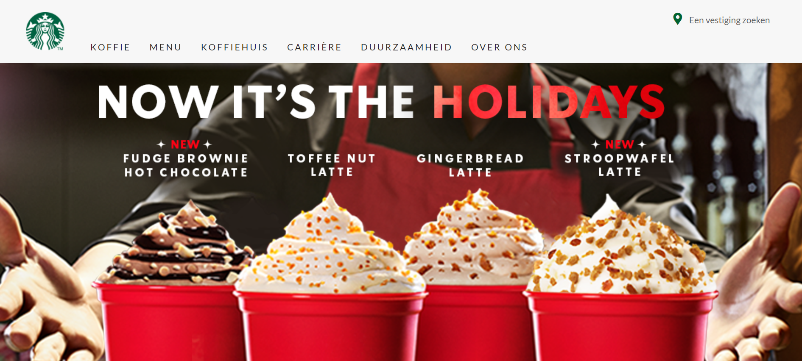
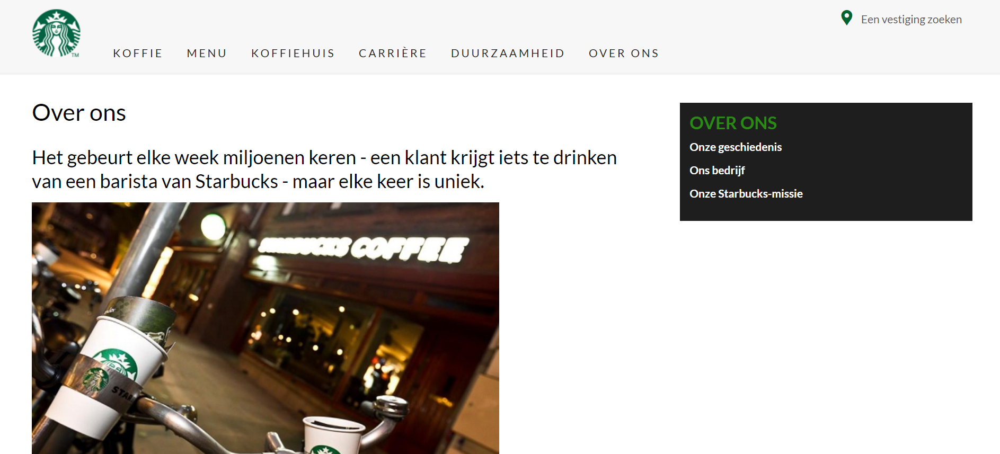
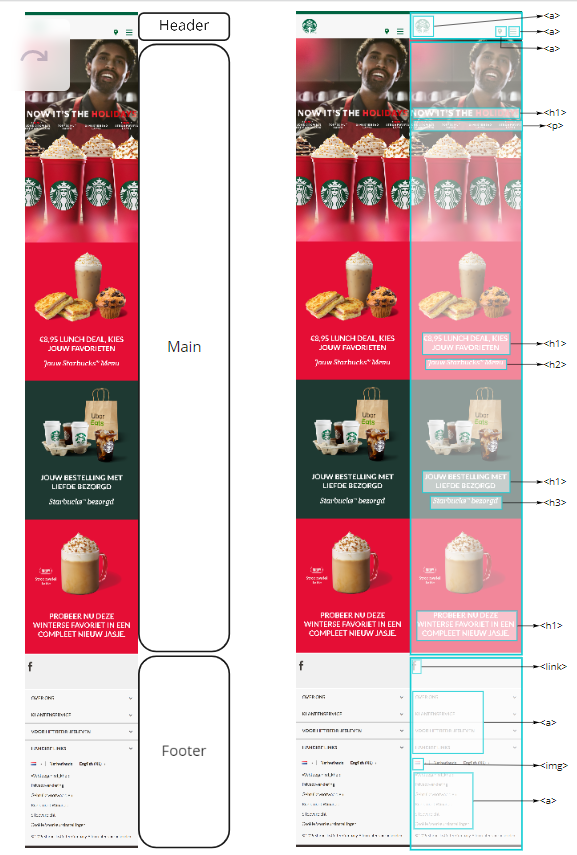
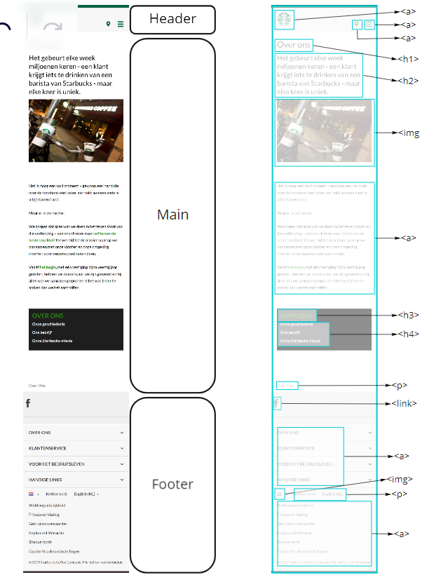

# Procesverslag
Markdown is een simpele manier om HTML te schrijven.  
Markdown cheat cheet: [Hulp bij het schrijven van Markdown](https://github.com/adam-p/markdown-here/wiki/Markdown-Cheatsheet).

Nb. De standaardstructuur en de spartaanse opmaak van de README.md zijn helemaal prima. Het gaat om de inhoud van je procesverslag. Besteedt de tijd voor pracht en praal aan je website.

Nb. Door *open* toe te voegen aan een *details* element kun je deze standaard open zetten. Fijn om dat steeds voor de relevante stuk(ken) te doen.

## Jij

uitwerken voor kick-off werkgroep

### Auteur:
Esther Bonenkamp

#### Je startniveau:
blauw

#### Je focus:
responsive
 

## Je website

uitwerken voor kick-off werkgroep

### Je opdracht:
https://www.starbucks.nl/

#### Screenshot(s) van de eerste pagina (small screen): 
Homepagina  

#### Screenshot(s) van de tweede pagina (small screen):
Over ons  

 

## Breakdownschets (week 1)

uitwerken na afloop 2e werkgroep

### de hele pagina: 

### dynamisch deel (bijv menu): 

## Voortgang 1 (week 2)

uitwerken voor 1e voortgang

### Stand van zaken
Ik heb geen screenshots gemaakt van mijn code maar het bestond deze week alleen nog maar uit de basic HTML.

### Agenda voor meeting
Wij hebben niet samen met het groepje besloten waar we het over wilde hebben we hebben individuele vragen gesteld.
Ik had een vraag over de home pagina, dit ging om de plaatjes. Ik had ze eerst allemaal als background image maar het lukte niet om de tekst er midden op te krijgen.

### Verslag van meeting
-  Ik heb om hulp gevraagd met de plaatjes en toen kreeg ik het uitgelegd in Codepen
-  https://codepen.io/robertspier/pen/KKvOoBg?editors=0100
-  verder klopte mijn site 

## Voortgang 2 (week 3)

uitwerken voor 2e voortgang

### Stand van zaken
Ik was goed op dreef met de eerste pagina, de plaatjes en tekst heb ik namelijk in de werkgroep responsive kunnen maken. Ook heb ik een klein begin gemaakt aan de tweede pagina.

### Agenda voor meeting
We hebben het er weer niet samen met het groepje over gehad.
Ik had een vraag over het menu in de header.

### Verslag van meeting
-  Ik ben vooral geholpen met flexbox want ik ben daar niet zo goed in.

## Toegankelijkheidstest (week 4)

uitwerken na test in 8e voortgang

### Bevindingen
- De onderdelen werden juist benoemd
- De screenreader ging niet automatisch verder
- Interactieve onderdelen

#### Onderdelen
De onderdelen in mijn pagina werden juist benoemd, dus bijvoorbeeld een list en link

#### Screenreader
De screenreader las niet automatisch de pagina maar ik kwam erachter dat ik zelf verder moest scrollen en dat dan pas de tekst wordt voorgelezen

#### Interactieve onderdelen
Ik heb niet zoveel interactieve onderdelen op mijn hoofdpagina dus die werden niet

## Voortgang 3 (week 4)

uitwerken voor 3e voortgang

### Stand van zaken
Hier was ik bezig met de laatste details. Ik liep tegen heel veel dingen aan en ik heb ook heel veel hulp gevraagd bij de student-assistenten en Casper. Uiteindelijk is het me wel gelukt om de footer responsive te maken met de media tag. 

### Agenda voor meeting
We hebben wederom niet met het groepje besproken waar we het over wilden hebben

### Verslag van meeting
- ik ben geholpen met de footer, met behulp van een mediatag heb ik die responsive kunnen maken
- ook heb ik dit geprobeerd bij het menu bovenin de header maar dat is helaas niet gelukt. Na de meeting heb ik nog 2 keer gebeld met de student-assistent en met Casper maar het is me echt niet gelukt om het responsive te maken.

## Eindgesprek (week 5)

uitwerken voor eindgesprek

### Stand van zaken
Al met al vond ik het echt heel lastig om deze website na te maken. Ik ben wel trots op het eindresultaat maar ik vind het jammer dat ik het menu bovenin de header niet responsive heb kunnen maken. Ookal heb ik wel veel om hulp gevraagd het is uiteindelijk toch niet gelukt. Ook heb ik heel erg veel gebruik gemaakt van bronnen omdat ik steeds tegen kleine dingen aanliep en door de bronnen begreep ik het meestal wel.

### Screenshot(s)

## Bronnenlijst

continu bijhouden terwijl je werkt

Nb. Wees specifiek ('css-tricks' als bron is bijv. niet specifiek genoeg).

1. https://codepen.io/shooft/pen/vYZKQPX voor flexbox in het algemeen
2. https://codepen.io/robertspier/pen/KKvOoBg?editors=0100 voor de eerste pagina, om het plaatje juist te krijgen met de tekst in het midden
2. https://codepen.io/shooft/pen/dyRVVRr voor het menu
2. https://codepen.io/shooft/pen/gOrJdGG?editors=1100 voor de focus en hover in het menu
3. https://www.w3schools.com/cssref/css3_pr_text-shadow.asp voor de h1 schaduw
4. vhttps://codepen.io/shooft/pen/abwLyvm?editors=0100 voor het menu in de over ons pagina
5. https://www.w3schools.com/tags/tryit.asp?filename=tryhtml5_details footer
6. https://www.w3schools.com/cssref/pr_text_text-transform.asp om tekst uppercase te maken
7. https://codepen.io/Chaspyr/pen/RwLKyav om te kijken of het menu bovenin lukt
8. https://www.w3schools.com/css/css_font_fallbacks.asp voor fallback fonts
9. https://www.w3schools.com/cssref/css3_pr_mediaquery.asp om de media tag te begrijpen

